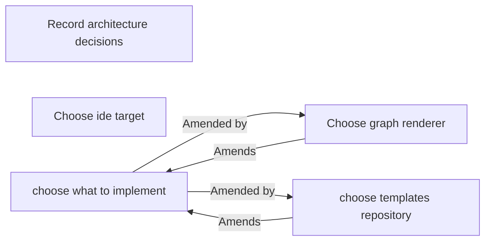

```mermaid
graph LR
0000[Record architecture decisions]
click 0000 "0000-record-architecture-decisions.md"
0001[Choose ide target]
click 0001 "0001-choose-ide-target.md"
0002[choose what to implement]
click 0002 "0002-choose-what-to-implement.md"
0003[choose templates repository]
click 0003 "0003-choose-templates-repository.md"
0004[Choose graph renderer]
click 0004 "0004-choose-graph-renderer.md"
0002 --> |Amended by|0004
0002 --> |Amended by|0003
0003 --> |Amends|0002
0004 --> |Amends|0002
```
